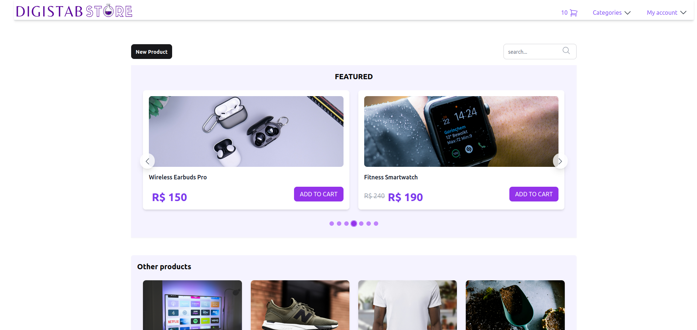
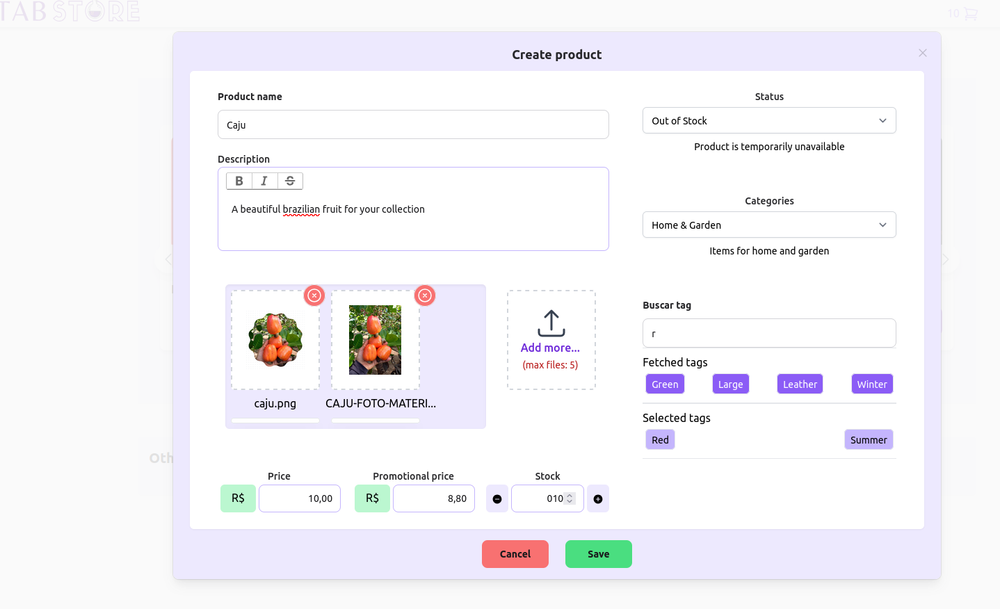
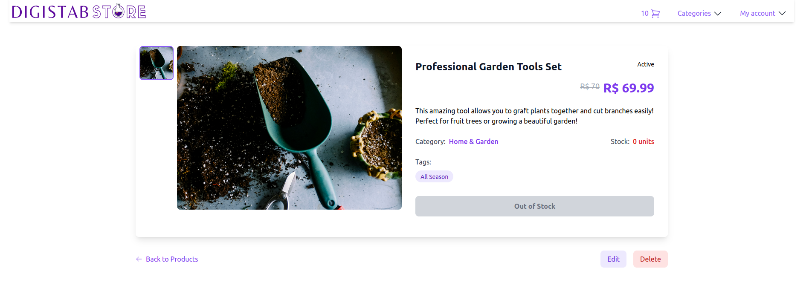

# DigistabStore - A modern E-Comerce Plataform

Hi, welcome to Digistab Store! 👋<br/>
This is my portfolio project showcasing a modern e-commerce platform built with Elixir and Phoenix LiveView. I created this project to demonstrate my expertise in building real-time web applications with a focus on user experience and my skills with all that LiveView has to provide.


## ✨ Key Features

### Real-time Product Management
- Dynamic product creation and editing with live updates
- Rich text description editor for detailed product information
- Multi-image upload with S3 integration
- Smart price and stock management

### Smart Search & Organization
- Category-based product organization
- Real-time search with instant results
- Tag system for flexible product classification
- Featured products carousel

### Modern User Experience
- Responsive design that works on all devices
- Real-time updates without page refreshes
- Image galleries with lazy loading
- Clean, intuitive interface

## 🛠 Technology Choices

That's some technologies that I have mastered:

### Backend
- **Elixir & Phoenix**: For scalability and real-time features
- **PostgreSQL**: Reliable data storage with powerful querying capabilities, and an amazing relation with Ecto.

### Frontend
- **Phoenix LiveView**: Enabling rich, real-time user experiences without complex JavaScript
- **TailwindCSS**: For rapid UI development and consistent design
- **AlpineJS**: Lightweight JavaScript for enhanced interactivity
- **Hero Icons**: Beautiful, consistent iconography

### Infrastructure
- **AWS S3**: Scalable image storage
- **AWS CodeDeploy**: Automated deployment pipeline
- **GitHub Actions**: CI/CD automation

## 🚀 See It In Action

Visit the live demo: [DigistabStore Demo](https://digistab-store.alissonmachado.dev/)

### Preview Screenshots





### 👨‍💻 What you can do?

In this early version, you can do some basic things:

- Main page with product list, search bar, and a beautiful hero made with AlpineJS.
- Filter items by name or description in the search bar.
- Add products.
- View details about the product in show page.
- Edit the existent products (photo edit not available yet).


### 🌟 What's Next?

I'm continuously improving this project. Here are some features I'm planning to add:

- Advanced search filters
- User authentication
- Shopping cart functionality
- Order management system
- Payment integration


## 💻 Local Development

Want to run this project locally? Here's how:

1. Prerequisites:
   ```bash
   # Versions I used for development
   elixir 1.17
   erlang 27
   postgres 12+
   node 18+
   ```

2. Setup:
   ```bash
   # Install dependencies
   mix setup

   # Start the server
   mix phx.server
   ```

Visit [`localhost:4000`](http://localhost:4000) to see the application running.

## 🎓 Learning Resources

During the development of this project, I found these resources particularly helpful:

- [Phoenix LiveView Documentation](https://hexdocs.pm/phoenix_live_view)
- [Elixir School](https://elixirschool.com/)
- [TailwindCSS Documentation](https://tailwindcss.com/)
- [AlpineJS Documentation](https://alpinejs.dev/)
  
<!---

# 🙍 The things will become a little personal below
So if you are more interested on the tech part of this project, thank you so much and I hope this could help you somehow in your path. Thank you so much for your time.

## 📚 About the project  
This project starts as a concept for a tech challenge for my second company, Envixo, the name become at the first second, using 'Digital' + 'Stab' from a stabilo pen on my desk, and the description passed to me was very simple, a CRUD for products, to register, show, delete and edit. Nothing more than that. 

At this point, I was a little frustrated about a lot of responsibilities, and I never felt much confident on what I could delivery, so I made without paying much attention, and at the end I was with a good work on my hands, I could deliver it with proud and the role was mine. So this project always lived in a good place on my mind and my heart, and I always wanted resume and put my effort and new techniques on this. after 3 years, now I have a good basis to how my capacities and enhance my knowledges, putting it on highlights on my profile.


## 🙋 Special Thanks
First of all, and for more that it looks prepotent, Me, for never give up when the things become too hard to understand or when that feelings of incapacity starts to make me doubt myself, as much as all this could delay me, I never give up, once I realized that this is what I want to do, I knew that somehow and someday, I would grab in my hands all that I deserve for still fighting for.

Of course, not alone, I think there are so many people who have passed through my life and thrown a seed into this soil, I would never take care of this garden alone. from my College friends, Viviane, Leonardo, Francielle, Brenda, and other many that may will make me update this section, thank you so much for never let me give up, not about the course, about this area in general, we both grow a lot together, I know I made a mark in your life as you all made in mine.

For my best friend of all, José Viriato, who always guide me even don't knowing where himself is going (sometimes, I think you should listen yourself more), you always helped me when I was in my perfectionists delusions, when I was planing megalomaniac things, and at the end, never even started. Thank you so much.

my dearest ex-coworker friends, Felipe Stival, my first boss, and who gave me the love for all this technology, who spend so much time on my beginning to share stupid and obvious things like find something in a log, and who fill me with regards when I created a geolocation distance code that uses the curvature of the earth as a parameter, and so much more, always present to give me advices and tips, and for Elton Campos, who was always more optism than me and now I'm inspired to do the same with my life and career.

So, must recently, my dear Juan Almeida (you could find him at [github](https://github.com/juanrtalmeida)), that gave me that initial spark I always needed, all those simple conversations press a button to start realising who I am, and where I want to arrive, I grab all that advices we both share, (I confess, much of I said I wasn't putting on pratice in my own life) and now I use them all. Thank you so much and I can't wait to see how much you grow too.

It's funny cause it looks like a dedicatory in conclusion works for a graduation, and somehow this project it's something like that to me. So thanks to everyone who gave me a piece of knowledge, you make me.

-->
